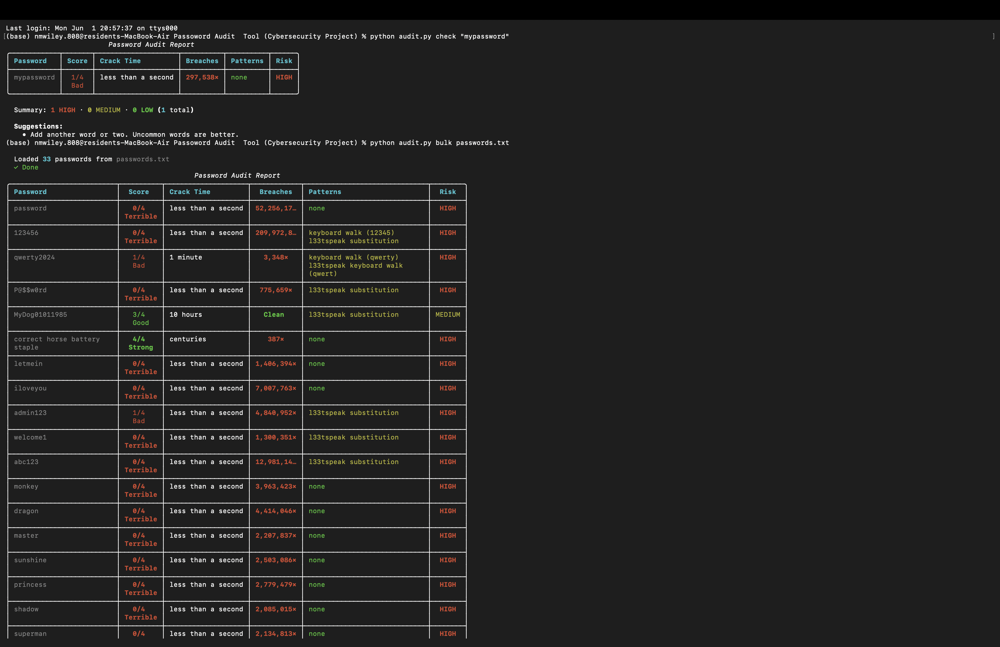

# Password Audit Tool (IT/Cybersecuirty Project)

A IT/Cybersecurity CLI tool and Google Colab notebook for auditing passwords
for strength, breach exposure, and dangerous structural vulnerabilities.

Built with `zxcvbn`, `rich`, `requests`, `hashlib`, and `click`.

---

## Demo




---

## Features

| Feature | Description |
|---|---|
| Strength scoring | Realistic crack-time estimation via `zxcvbn` — not just length/complexity rules |
| Breach detection | k-anonymity SHA1 lookup via HaveIBeenPwned — password never leaves your machine |
| Pattern detection | Flags keyboard walks, dates, repeated chars, and l33tspeak substitutions |
| Color-coded report | Green / amber / red Rich table output in the terminal |
| Bulk audit | Audit an entire `.txt` file of passwords in one command |
| CSV export | Save a full audit report as a shareable spreadsheet |
| CLI interface | Portable `audit.py` script with `--flags` and `--help` via `click` |

---

## Quickstart

```bash
# Install dependencies
pip install zxcvbn rich requests click

# Check a single password
python audit.py check "mypassword"

# Bulk audit a password list
python audit.py bulk passwords.txt

# Bulk audit and export results to CSV
python audit.py bulk passwords.txt --output report.csv

# Skip HIBP breach check (offline mode)
python audit.py check "mypassword" --no-hibp
```

---

## Project Structure

```
Password-Audit-Tool/
├── audit.py                  # Standalone CLI tool (click)
├── password_audit_tool.ipynb # Development notebook (Google Colab)
├── passwords.txt             # Sample password list for testing
└── README.md
```

---

## How It Works

### Strength Scoring
Wraps Dropbox's `zxcvbn` library to return a score from 0–4, an estimated
offline crack time, and improvement suggestions. More realistic than
traditional length and complexity rules alone.

### Breach Detection
Hashes the password with SHA1, sends only the **first 5 characters** of the
hash to the HaveIBeenPwned API, then checks the returned suffix list locally.
Your actual password is never transmitted to any external service.

### Pattern Detection
Regex and string matching catches structural vulnerabilities that `zxcvbn`
may underweight:
- Keyboard walks (`qwerty`, `asdf`, `12345`)
- Date patterns (`01011990`, `2024`, `MM/DD/YY`)
- Repeated characters (`aaaa`, `1111`)
- L33tspeak substitutions masking simple words (`P@$$w0rd`)

### Risk Levels

| Level | Condition |
|---|---|
| 🔴 HIGH | Breached in known data leaks OR strength score 0–1 |
| 🟡 MEDIUM | Strength score 2 OR structural patterns detected |
| 🟢 LOW | Score 3–4, no breaches, no patterns |

---

## Tech Stack

| Library | Purpose |
|---|---|
| [`zxcvbn`](https://github.com/dwolfhub/zxcvbn-python) | Password strength estimation |
| [`rich`](https://github.com/Textualize/rich) | Color-coded terminal output |
| [`requests`](https://docs.python-requests.org/) | HaveIBeenPwned API calls |
| [`click`](https://click.palletsprojects.com/) | CLI interface and argument handling |
| [`hashlib`](https://docs.python.org/3/library/hashlib.html) | SHA1 hashing (stdlib) |
| [`re`](https://docs.python.org/3/library/re.html) | Pattern detection (stdlib) |

---

## Privacy & Security

This tool uses
[k-anonymity](https://haveibeenpwned.com/API/v3#SearchingPwnedPasswordsByRange)
for all breach lookups. Only the first 5 characters of a SHA1 hash are ever
sent to the HaveIBeenPwned API. Your passwords are never transmitted,
logged, or stored anywhere.

---

## Author

Noah Wiley · [LinkedIn](https://www.linkedin.com/in/noah-wiley-a20558410/)
